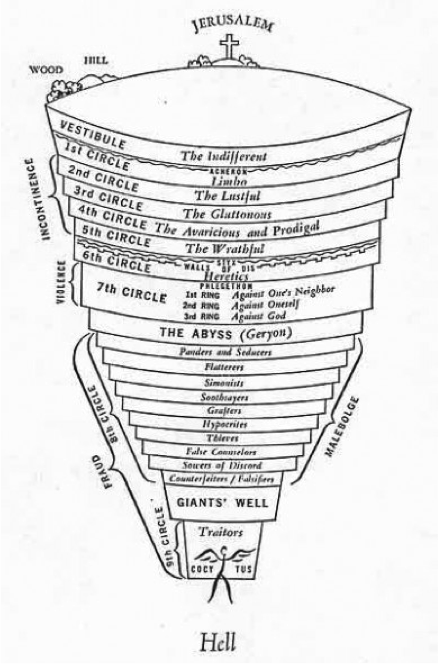

#2016-10-13 Digital Dante

## Preliminary

Sample image:

* GitHub directory structure: **misc**, **txt**, **web**, **python** subdirectories
	* **dante\_website\_layout.docx** should be in **web** subdirectory (and should be markdown, not Word)
* Documentation should be in markdown
	* To embed an image, put the image in the **images** subdirectory file and code for it with `` (or other path to image file)
* Remember file-naming conventions: <http://dh.obdurodon.org/file-naming_conventions.xhtml>.

	* **Research Question.docx** (Word document, and with a space) should be **Research_Question.md** (markdown document, with an underscore—or hyphen, camelCase, etc.)
	* **Inferno text** (no extension, and with a space) should be **Inferno_text.txt** (or something similar)
	* Decide on capitalization and word division conventions for project. Currently **dante\_website\_layout.docx** is all lower case, the "research question" document capitalizes all words, and the "Inferno text" document capitalizes only the first word. Suggestions: all lower case.

## From last time

### Everyone

* Think about how to use WordNet in project (see [David's email](http://dh.obdurodon.org/drupal/comment/4131#comment-4131)) and prepare to discuss next week
* Read [Markdown tutorial](https://github.com/adam-p/markdown-here/wiki/Markdown-Cheatsheet)
* Read [GitHub tutorial](http://dh.obdurodon.org/github.xhtml)
* Look for images of hell (not under copyright) that can be used for textual navigation

### Emma

* Write up research question (one or two paragraphs; will eventually be incorporated in project page). General description is: 
<blockquote>Language of pain: how are pain, suffering, and torture represented at the different levels (refine to include hypothesis)</blockquote>
Writeup should be in [markdown](https://github.com/adam-p/markdown-here/wiki/Markdown-Cheatsheet) and should be pushed to GitHub in **misc** subdirectory.
* Weekly blog posting

### Meghan

* We have already selected a text and pushed it to GitHub in **txt** subdirectory. Edit to remove Gutenberg or other metadata *save it under another filename* (so that we can add metadata to the eventual XML).
* Read [MALLET tutorial](http://programminghistorian.org/lessons/topic-modeling-and-mallet) and practice (select some arbitrary data)

### Jessica

* Design schema and proof of concept markup samples, and push to GitHub in **web** subdirectory.
* Read [MALLET tutorial](http://programminghistorian.org/lessons/topic-modeling-and-mallet) and practice (select some arbitrary data)

### Nikki

* Webmaster (will oversee HTML and CSS)
* Outline web site structure (pages, linking). Description should be in [markdown](https://github.com/adam-p/markdown-here/wiki/Markdown-Cheatsheet) and should be pushed to GitHub in **web** subdirectory. Creating sample HTML or CSS is optional this week; if you do create some content for publication, it should be uploaded to /var/www/html/dante (ask for help if you have trouble finding it). 
* Plan CSS. Notes should be in [markdown](https://github.com/adam-p/markdown-here/wiki/Markdown-Cheatsheet) and pushed to GitHub in **web** subdirectory.
* Read about image maps (see the links to tutorials at <http://designreviver.com/tutorials/css-image-map-techniques-and-tutorials/>; pick any one that looks interesting). Will eventually use image map of hell for textual navigation.
* All participants will look for images; Nikki will coordinate

